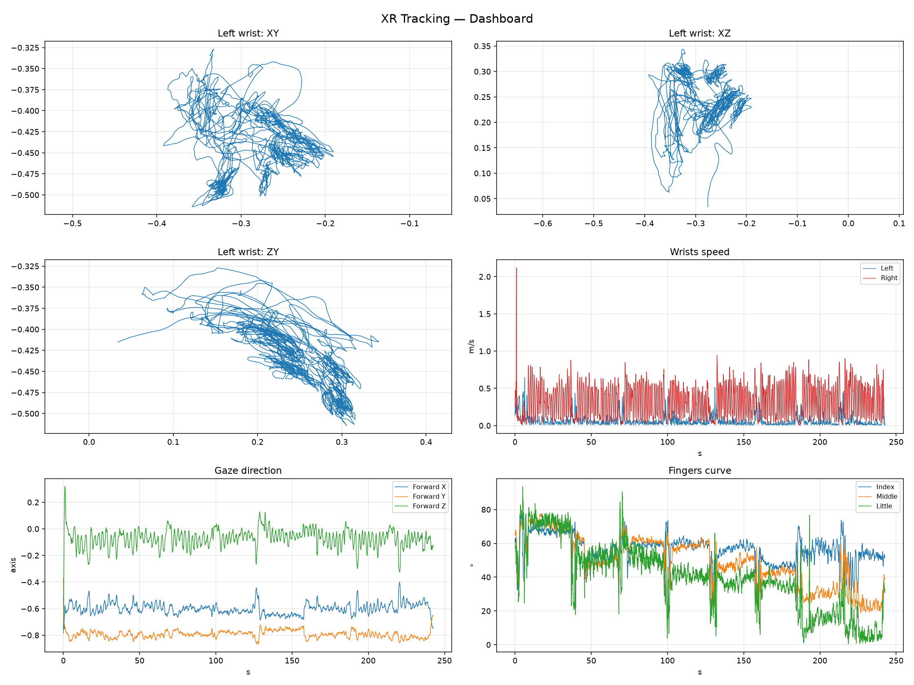

# XR Hand Tracking Visualization

Parsing, analysis, and interactive 3D visualization of hand and head
tracking data recorded with a VR headset (PICO 4 Ultra, XRoboToolkit).

The repo contains a streaming parser for the raw tracking log, a set of
2D analytical plots, and an interactive 3D animation of the hand skeleton,
head orientation, and body joints with a time slider.

## Table of contents

- [What's inside](#whats-inside)
- [Data](#data)
- [Quick start](#quick-start)
- [Approach](#approach)
- [Results](#results)
- [Observations](#observations)
- [Challenges & solutions](#challenges--solutions)
- [Repository structure](#repository-structure)
- [What could be improved](#what-could-be-improved)

## What's inside

| Script | Purpose |
|---|---|
| `src/parse_tracking.py` | Streaming parser for `trackingData_*.txt` → compact `.npz` |
| `src/visualize_2d.py` | Matplotlib plots: trajectories, speed, gaze direction, finger flexion |
| `src/visualize_3d.py` | Interactive Plotly 3D animation of both hands + head + body |

## Data

Two files are provided with the task and are **not** stored in this repo
(too large for GitHub):

- **`CameraRecord_20260505_165740.mp4`** — stereo first-person video from
  the headset, ~4 min.
- **`trackingData_20260505_165740.txt`** — tracking log, 250 MB.

Place tracking log into `data/` before running the scripts.

### Data format

- File: JSON-like lines, but **the decimal separator is a comma**.
  This breaks `json.loads()` — the file needs a custom parser.
- First line: camera intrinsics + extrinsics (both eyes).
- Remaining lines: one tracking frame each.
- Frame fields:
  - `predictTime` (µs, monotonic runtime clock)
  - `timeStampNs` (Unix time in nanoseconds)
  - `Head.pose` — 7 floats: `x, y, z, qx, qy, qz, qw`
  - `Hand.leftHand` / `Hand.rightHand` — 26 hand joints (OpenXR layout),
    each with 7 floats (position + quaternion) and a status bitmask `s`
  - `Body.joints` — 24 body joints (PICO Body Tracking), each with 7 floats
- Units: meters. Coordinate system: Y-up, Z-forward.

### Recording summary

- 21,787 frames, 242.5 seconds, ~90 Hz.
- Left hand active 100% of the time; right hand 99.4%.
- Head pose and both hands parsed without NaN.

## Quick start

Tested with Python 3.12 on Arch Linux. Fish shell is assumed
below; for bash/zsh use `source .venv/bin/activate` instead.

```bash
# 1. Setup
uv venv --python 3.12
source .venv/bin/activate.fish
uv pip install -r requirements.txt

# 2. Place the input files
mkdir -p data
# copy trackingData_20260505_165740.txt into data/

# 3. Parse the raw log (~7 s for 250 MB)
python src/parse_tracking.py --input data/trackingData_20260505_165740.txt

# 4. Generate 2D plots into outputs/figures/
python src/visualize_2d.py

# 5. Generate the interactive 3D HTML
python src/visualize_3d.py --step 10
# open outputs/hand_animation.html in a browser
```

## Approach

I chose interactive 3D visualization as the primary representation,
since the tracked motion lives in 3D space. The scene is rendered with
Plotly into a self-contained HTML file — no server, no build step —
and shows both hand skeletons (26 joints each), head position with a
forward-vector arrow, and 24 body joints, with a time slider and
Play/Pause. As a secondary analytical layer I added six 2D plots
(Matplotlib): wrist trajectories in three projections, wrist speed over
time, hand activity timeline, head gaze direction, and finger flexion
angles, plus a combined dashboard.

Controls in the 3D scene: drag to pan, wheel to zoom, ← / → to
rotate the camera, R to reset the view, slider to scrub through time.

## Results



Open the full interactive [3D scene](https://koverartem.github.io/Robotics-test-task/outputs/hand_animation.html)


## Observations

Only the left hand is actively used. Right hand reports
isActive = 1 in 99.4% of frames but stays still — confirmed by the
near-zero wrist speed in the video.

The user looks down at the workspace. The head's forward vector
stays around (-0.57, -0.24, +0.78) — mostly forward.

Wrist speed. Left wrist median ~0.05 m/s (static, holding the
controller), right wrist median ~0.4 m/s with peaks up to ~0.9 m/s.

Finger curve on the left hand is periodic (~30–40 s), with the
index finger flexing more than the little finger during grasp.

Two independent time scales. predictTime is in microseconds
(runtime clock), timeStampNs in Unix nanoseconds. Their ranges
differ by ~1000×, but the median step is identical (11.12 ms), so
predictTime is used for motion timing.


## Challenges & solutions

Parsing the "JSON with commas" was the main difficulty. The file
uses , as both the decimal separator and the JSON field separator —
e.g. "p":"-0,316226125,-0,4188593,...". A naive s.split(",") splits
each float in two, and json.loads fails outright. I wrote a custom
streaming parser that:

- extracts p / pose strings with a regex,
-inside each string, matches -?\d+(?:,\d+)? so decimal commas stayattached to their number,
-converts , → . per token,
-never touches the JSON-level commas.

The first line is special: cameraIntrinsics / cameraExtrinsics are
valid JSON and use standard dots, so they are parsed separately.
Combined with the streaming approach, parsing the 250 MB file takes
~7 seconds.